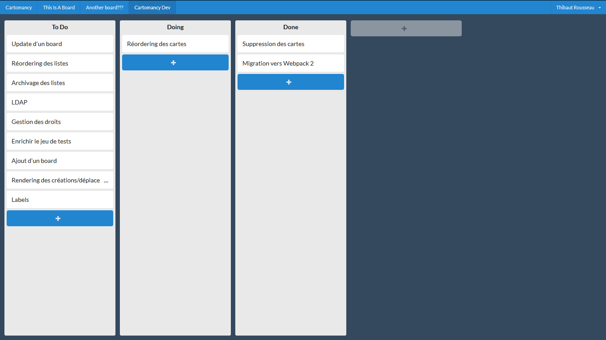

# Cartomancy

This is the frontend of Cartomancy.

* [cartomancy-backend](https://github.com/Thiht/cartomancy-backend)
* [cartomancy-frontend](https://github.com/Thiht/cartomancy-frontend)

## Get started

### Requirements

* [NodeJS](https://nodejs.org/en/), at least the LTS version.
* [Cartomancy Backend](https://github.com/Thiht/cartomancy-backend), running on [http://localhost:8090/](http://localhost:8090/) by default. This can be configured in the [config files](./config/).

Before anything, install the dependencies:

    npm install

### Development

Run the server with hot-reload with the command:

    npm start

The recommended development environment is [Visual Studio Code](https://code.visualstudio.com/) with the following plugins:

* [EditorConfig for VS Code](https://marketplace.visualstudio.com/items?itemName=EditorConfig.EditorConfig)
* [ESLint](https://marketplace.visualstudio.com/items?itemName=dbaeumer.vscode-eslint)

## License

See the [LICENSE](./LICENSE.md) file.
